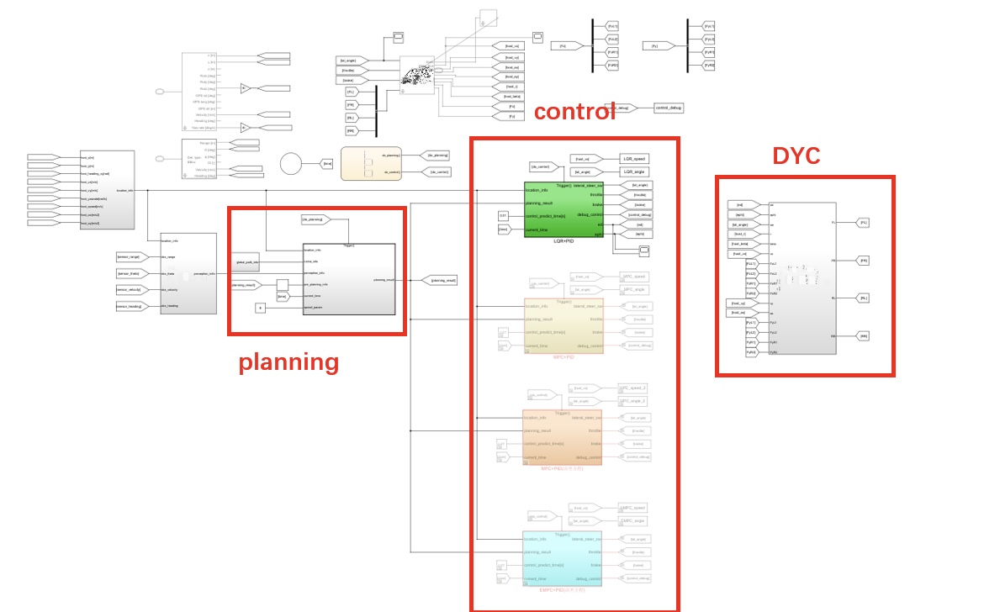
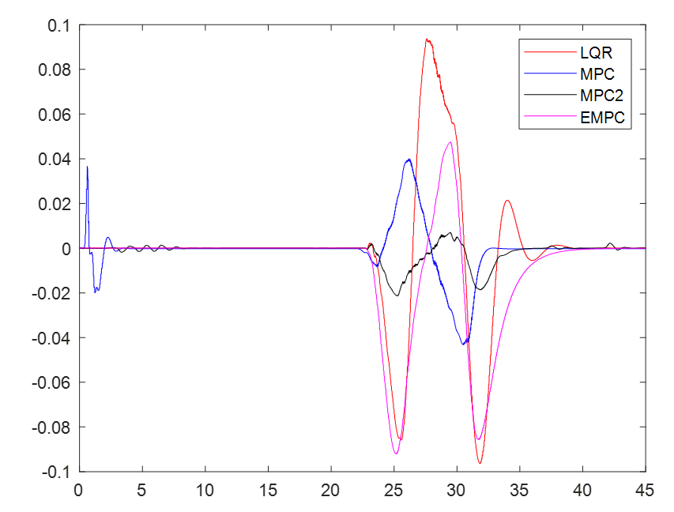
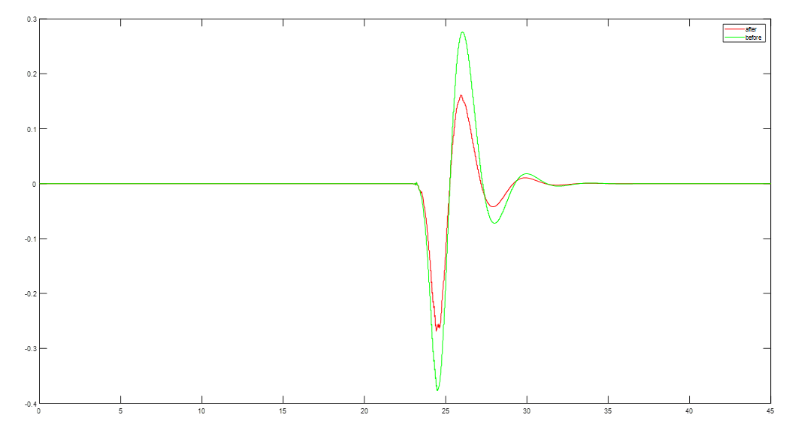

# self-driving-planning-and-control
After watching the videoes of "[VincentWong](https://space.bilibili.com/287989852/?spm_id_from=333.999.0.0)" on bilibili, based on [his framework](https://github.com/VincentWong3?tab=repositories), the algorithm of the trajectory tracking part has been enriched, and the DYC stability control has been added, making the tracking effect better and the yaw stability improved.

## Abstract

Based on the original framework, MPC (Model Predictive Control for Unmanned Vehicles - Gong Jianwei), MPC based on MPT3, and EMPC based on MPT3 are added; 

DYC control is added, with yaw rate and center of mass sideslip angle as inputs, and the additional torque of the four wheels as outputs.

## Model framework

## Performance

### Control effect

y:error(m)    x:time(s)

LQR:by Wang    MPC:by Gong    MPC2:by YALMIP    EMPC:by MPT3

### DYC effect

y:yaw_rate(m)    x:time(s)

## Get started

1. MATLAB 2022a
2. Carsim 2019
3. PreScan
4. install [MPT3 toolbox](https://www.mpt3.org)
5. install [YALMIP](https://yalmip.github.io)

## To Do

1. control part
- [ ] The performance of EMPC can be improved
2. DYC part
- [x] DYC is needed to improve the yaw stability
3. longitudinal speed planning needs to be optimized
- [ ] This is th content of my graduation thesis
